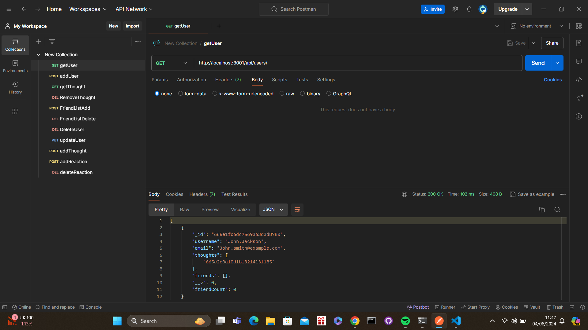

# Social-Network-API

## What was my objective and what have i accomplished?
In this weeks challenge I was tasked with creating a fully functioning social network API which i have successfully been able to accomplish by ensuring that the user is able to do the following tasks:

* Get/Add and remove users
* Get/Add and remove thoughts
* Get/Add and remove friends
* Get/Add and remove reactions

In addition i was also able to ensure that this was all linked in with the MongooseDB by ensuring that when the server is started the mongoose Models are also synced. When the user runs these requests through Insomnia or Postman they will be able to view and change all of the data that is stated above

https://drive.google.com/file/d/15YU_yS6CEOFx85hP4EfKun2TPN9Sv-jj/view

